<p align="center">
  
</p>

<p align="center">
  <a href="https://github.com/jeiel85/localops-bot/actions"></a>
  <a href="https://github.com/jeiel85/localops-bot/blob/main/LICENSE"></a>
  <a href="https://dotnet.microsoft.com/"></a>
  <a href="https://github.com/jeiel85/localops-bot/issues"></a>
</p>

<p align="center">
  <b>LocalOps Bot</b> &mdash; 개인 Windows PC 상태, 부팅, 장애, 알림을 Telegram으로 확인하고 알림받는 개인용 모니터링 봇입니다.<br>
  외부 포트를 열지 않고, outbound HTTPS만으로 동작합니다.
</p>

<p align="center">
  <a href="#-features">Features</a> •
  <a href="#-getting-started">Getting Started</a> •
  <a href="#-commands">Commands</a> •
  <a href="#-architecture">Architecture</a> •
  <a href="#-tech-stack">Tech Stack</a> •
  <a href="#-project-structure">Project Structure</a>
</p>

---

## ✨ Features

| | Feature | Description |
|---|---|---|
| 🖥️ | **System Status** | CPU, RAM, disk, network, uptime via Telegram |
| 🚀 | **Boot Notification** | Get alerted when your PC boots up |
| 👁️ | **Process/Service Watch** | Monitor Ollama, PostgreSQL, dev servers |
| 📋 | **Event Log Watch** | Forward Windows Error/Critical events |
| 🔔 | **Toast Forwarding** | Forward Windows notifications with privacy filtering |
| 🔒 | **Privacy First** | Mask passwords, OTPs, tokens; block sensitive apps |
| 🔇 | **Quiet Hours** | `/mute 1h` to silence alerts temporarily |
| 📊 | **SQLite Logging** | Persistent command and alert history |

## 🚀 Getting Started

### Prerequisites

- Windows 10/11
- [.NET 9 Runtime](https://dotnet.microsoft.com/download/dotnet/9.0)
- Telegram account + [BotFather](https://t.me/BotFather) token

### Quick Install

```powershell
# 1. Download the latest release
# 2. Set your Telegram token
[Environment]::SetEnvironmentVariable("LOCALOPSBOT_TELEGRAM_TOKEN", "your_token_here", "Machine")

# 3. Run installer as Administrator
.\installer\install-service.ps1

# 4. Find your chat_id and configure
# 5. Start chatting with your bot!
```

### Manual Build

```powershell
dotnet build LocalOpsBot.sln
```

## 🤖 Commands

| Command | Description |
|---|---|
| `/ping` | Bot health check |
| `/help` | Show available commands |
| `/status` | Full PC status (CPU, RAM, disk, network) |
| `/uptime` | System uptime |
| `/disk` | Disk usage by drive |
| `/process` | Watched process status |
| `/services` | Windows Service status |
| `/events` | Recent Windows Event Logs |
| `/alerts` | Recent alert history |
| `/mute 1h` | Silence alerts for a duration |
| `/unmute` | Re-enable alerts |
| `/diagnostics` | Agent self-diagnostics |

## 🏗️ Architecture

```
┌─────────────────────────────────────────────┐
│ Telegram Mobile/Desktop                     │
└───────────────────┬─────────────────────────┘
                    │
                    ▼
┌─────────────────────────────────────────────┐
│ Telegram Bot API (outbound HTTPS, polling)   │
└───────────────────┬─────────────────────────┘
                    │
                    ▼
┌─────────────────────────────────────────────┐
│ Local Windows PC                             │
│                                               │
│  ┌─────────────────────────────────────────┐ │
│  │ LocalOpsBot.Agent (Windows Service)      │ │
│  │ • Boot notification                     │ │
│  │ • Status collectors                     │ │
│  │ • Event log watcher                     │ │
│  │ • Process/service watcher               │ │
│  │ • Telegram polling                      │ │
│  └───────────────────┬─────────────────────┘ │
│                      │ Named Pipe IPC        │
│  ┌───────────────────▼─────────────────────┐ │
│  │ LocalOpsBot.Tray (User Session App)      │ │
│  │ • Toast notification listener           │ │
│  │ • Notification filter/mask              │ │
│  │ • Local settings UI                     │ │
│  └─────────────────────────────────────────┘ │
│                                               │
│  ┌─────────────────────────────────────────┐ │
│  │ LocalOpsBot.Data (SQLite)               │ │
│  └─────────────────────────────────────────┘ │
└─────────────────────────────────────────────┘
```

## 🛠️ Tech Stack

<p>
  
  
  
  
  
  
  
</p>

| Component | Technology |
|---|---|
| Runtime | .NET 9 |
| Language | C# 12 |
| IPC | Named Pipes (length-prefixed JSON) |
| Database | SQLite via Microsoft.Data.Sqlite |
| UI (Tray) | WPF |
| Bot Protocol | Telegram Bot API (long polling) |
| DI/Hosting | Microsoft.Extensions.Hosting |
| Logging | Serilog |
| Testing | xUnit |

## 📁 Project Structure

```
LocalOpsBot/
├─ src/
│  ├─ LocalOpsBot.Core/           # Domain models, interfaces
│  ├─ LocalOpsBot.Infrastructure/ # Telegram, Windows collectors
│  ├─ LocalOpsBot.Data/           # SQLite persistence
│  ├─ LocalOpsBot.Agent/          # Windows Service entry
│  └─ LocalOpsBot.Tray/           # WPF Tray App
├─ tests/
│  └─ LocalOpsBot.Tests/          # Unit & integration tests
├─ installer/                     # PowerShell scripts
├─ config/                        # Sample configuration
├─ docs/                          # GitHub Pages landing
└─ assets/                        # Images, banners
```

## 📄 License

MIT &mdash; see [LICENSE](LICENSE) for details.

---

<p align="center">
  <sub>Built with .NET and ❤️</sub>
</p>
